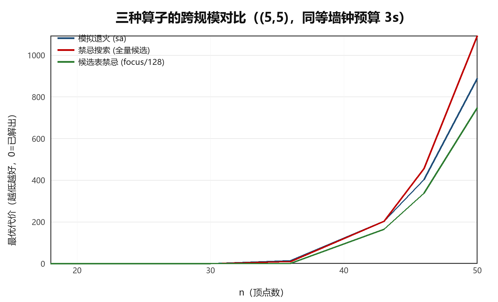
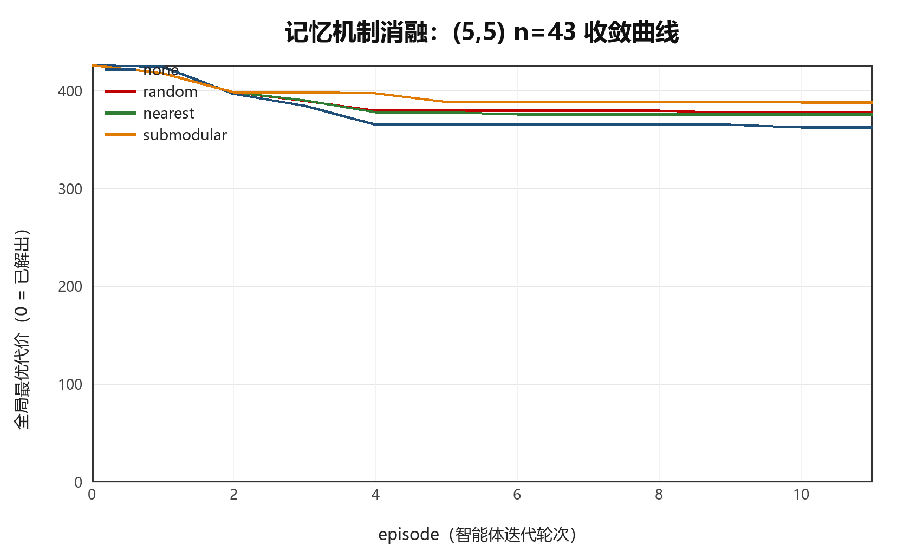
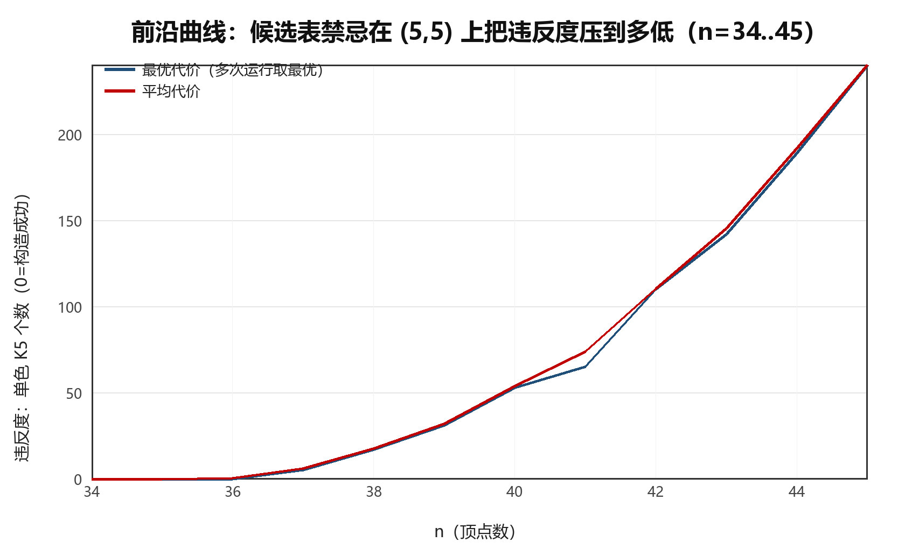

# MARSA — 记忆增强的 Ramsey 反例搜索智能体

**Memory-Augmented Ramsey Search Agent**

> 人工智能选修课大作业
> **姓名**：曹成博 · **学号**：2452035

---

## 这是什么

一个用来攻击 **Ramsey 数构造性下界问题** 的智能体，应用对象是著名的未解决问题
$R(5,5)$。

核心观察：$R(5,5)$ 的已知上界已经是 46，因此

> **只要能构造出一个 46 顶点的 $(5,5)$-图（既不含 $K_5$，也不含大小为 5 的独立集），
> 就立刻得到 $R(5,5)=46$，这个问题就此彻底解决。**

这把一个抽象的"求精确值"问题，**转化为目标明确、成败二元、可精确验证的搜索任务**。
智能体的目标函数是"违反度"（单色 $K_5$ 的个数），成功判据是违反度归零，
而合法性由独立实现的验证器复核。

---

## 核心结果 TL;DR

| # | 结果 | 性质 |
|---|---|---|
| 1 | 增量代价函数达 **~10 万次翻转/秒**（n=46），通过三重交叉验证 | ✅ 工程 |
| 2 | 在 7 个**已知精确值**的 Ramsey 实例上全部解出并通过独立验证 | ✅ 验收 |
| 3 | 提出**候选表禁忌**：n=43/46 上最优代价 195→**163** / 417→**334**（−16%/−20%），步频提升 7~8 倍 | ✅ **正面结果** |
| 4 | 四种解层记忆策略（含次模检索）在**两个预算区间内全部劣于冷启动**，并定位了机制 | ❌ **负面结果** |
| 5 | 实证前沿：构造出合法 $(5,5)$-染色（经独立验证）的最大规模 **n=36**，给出 n=34..45 完整前沿曲线 | ✅ 实证 |

另外在实验过程中发现并修复了一个使退火**完全失效**的真实 bug（温度时间表与步数上限未解耦），
并加入了回归测试锁死它。

---

## 研究问题

**Ramsey 数** $R(s,t)$ 是最小的 $n$，使得对 $K_n$ 的边做红蓝二染色时必然出现红色
$K_s$ 或蓝色 $K_t$。

$$43 \;\le\; R(5,5) \;\le\; 46$$

| 界 | 值 | 来源 |
|---|---|---|
| 下界 | $\ge 43$ | 一个 43 顶点的 $(5,5)$-图构造，1989 年至今未被改进 |
| 上界 | $\le 46$ | Angeltveit & McKay, *R(5,5) ≤ 46* (2024), arXiv:2409.15709 |

备用目标：$R(4,6) \in [35, 41]$，缺口 6 格，同样开放。

---

## 系统架构

```
┌──────────────────────────────────────────────────┐
│  ① 规划器 Planner（LLM 可插拔）                  │
│  脚本化规则 / UCB1 自适应 / LLM 三种实现          │
└───────────────┬──────────────────────────────────┘
                ▼
┌──────────────────────────────────────────────────┐
│  ② 执行器 Executor（CPU，确定性）                │
│  模拟退火 / 禁忌搜索 / 候选表禁忌                │
└───────────────┬──────────────────────────────────┘
                ▼
┌──────────────────────────────────────────────────┐
│  ③ 验证器 Verifier（独立实现，唯一有权宣布成功）  │
│  显式邻接矩阵 + 子集枚举（不用位掩码团计数）      │
└───────────────┬──────────────────────────────────┘
                ▼
┌──────────────────────────────────────────────────┐
│  ④ 长期记忆 Memory                                │
│  解层：障碍签名 + 次模（设施选址）检索            │
│  策略层：UCB1 按规模分桶学算子适用性              │
└──────────────────────────────────────────────────┘
```

**为什么 LLM 只做规划**：LLM 做原始组合搜索不可靠，但擅长"读统计 → 选策略"。
规划器可插拔，降级为脚本化规则时系统仍能完整运行，**保证实验可复现、不依赖任何 API**。

---

## 主要结果

### 1. 候选表禁忌（正面结果）

禁忌搜索原本是 best-improvement，每步要评估全部 $C(n,2)$ 条边，n 大时步频骤降。
我们把候选限制在一个子集上（`focus`：上一次移动两端点的关联边 + 随机补充），
并用**预计算关联表**使活跃区可在 $O(n)$ 内构造。

同一墙钟预算（3s）下：

| n | full 全量 | sample/128 | **focus/128** | 提速 | 相对 full |
|---|---|---|---|---|---|
| 36 | 9 | 3 | **1** | 4.6x | −89% |
| 43 | 195 | 167 | **163** | 6.9x | −16% |
| 46 | 417 | 331 | **334** | 7.9x | −20% |

跨规模对比（预算 3s）：

| n | sa | tabu（全量） | **tabu_focus/128** |
|---|---|---|---|
| 18 / 24 / 30 | 0 | 0 | **0**（均已解出） |
| 36 | 13 | 9 | **1** |
| 43 | 203 | 203 | **164** |
| 46 | 403 | 455 | **337** |
| 50 | 888 | 1094 | **748** |



### 2. 解层记忆消融（负面结果，含机制）



n=43，(5,5)，12 episodes × 3000 步，2 seeds：

| 策略 | 最优代价 | 平均最优代价 | 相对基线 |
|---|---|---|---|
| **none（冷启动）** | **358** | **362.0** | — |
| random | 372 | 377.0 | +4.14% |
| nearest | 373 | 375.5 | +3.73% |
| submodular | 383 | 387.5 | **+7.04%** |

**机制**：`none` 的 N 个 episode 是 N 次完全独立的随机重启取最小值；记忆模式只有
第 0 个 episode 是冷的，其余都在精修同一个盆地。而记忆里的 elite 代价约 370–390，
**比一次冷启动 3000 步能达到的 358 还差**，于是热启动把搜索锚定在平庸盆地。
日志显示 `improved_over_init` 达 22/22 —— 热启动确实在起点之上继续改进，
但起点本身太差。

> 结论：在这个问题族的地貌上，**多样化（独立重启）比强化（精修 elite）更有价值**。

### 3. 前沿曲线



用候选表禁忌在 n=34..45 上各跑 2 个种子、每次 20 秒（结果均经独立验证）：

| n | 34 | 35 | 36 | 37 | 38 | 40 | 43 | 45 |
|---|---|---|---|---|---|---|---|---|
| 最优代价 | **0** | **0** | **0** | 5 | 17 | 53 | 142 | 240 |
| 用时 | 0.2s | 2.3s | 15.4s | 20s | 20s | 20s | 20s | 20s |

**能构造出合法 $(5,5)$-染色（经独立验证）的最大规模为 n=36**，即实证 $R(5,5) > 36$。
世界纪录下界是 43，因此本项目**没有**刷新纪录 —— 这与选题时的预期一致
（选题说明中明确写"冲刺目标不保证"）。价值在于量化了引擎"能到哪"，
并给出可复现的难度爬升曲线。

---

## 快速开始

只需要 **Python 3 + numpy**（图表用 Pillow）。无 GPU、无网络依赖。

```bash
# 正确性验收（6 项，含与暴力枚举的交叉验证）
python tests/test_core.py

# 记忆模块测试（6 项）
python tests/test_memory.py

# 已知精确值阶梯：引擎验收门槛（应得 7/7）
python scripts/ladder.py 20000 tabu_focus

# 算子可扩展性
python scripts/bench_operators.py

# 候选表策略对比
python scripts/bench_candidates.py 3.0

# 跨规模算子矩阵 + 出图
python scripts/bench_matrix.py

# 前沿探测
python scripts/frontier.py --budget 20 --seeds 2

# 记忆消融
python scripts/run_ablation.py --n 43 --episodes 12 --steps 3000 --seeds 2

# 生成全部图表
python scripts/make_charts.py
```

---

## 目录结构

```
marsa/                  智能体核心
  bitset.py             位掩码团计数与增量违反度（引擎）
  verifier.py           独立暴力验证器（唯一有权宣布成功）
  search.py             模拟退火 / 禁忌搜索 / 候选表禁忌
  memory.py             解层记忆：障碍签名 + 次模检索
  strategy.py           策略记忆：UCB1 按规模分桶
  planner.py            三种规划器（脚本化 / LLM / 自适应）
  agent.py              智能体主循环 + JSONL 迭代日志
  charts.py             Pillow 图表渲染（环境不允许装 matplotlib）
tests/                  正确性与记忆模块测试
scripts/                全部实验脚本（见上）
runs/                   139 个实测 JSONL 迭代日志与结果 JSON
report/figures/         报告图表（由脚本自动生成，无手工修饰）
tools/                  Markdown → DOCX/PDF 报告生成工具
实验报告.md / .pdf       完整实验报告
选题说明.md / .pdf       选题说明
实验记录与阶段结论.md     实验过程记录（含被推翻的假设与 bug 复盘）
```

---

## 诚实声明与局限

1. **没有刷新世界纪录**。前沿停在 n=36，而已知下界是 43。本项目的价值在于
   方法、验证与可复现的量化结果，不在于解决 $R(5,5)$。
2. **解层记忆的结论是负面的**，但给出了机制解释与定量证据，我们把它如实报告
   而不是隐藏。
3. **策略层记忆无法超越事后最优的固定算子**，这符合理论上限；它能做的是
   *无需人工调参地收敛到该算子*。
4. 项目中曾出现一个使退火完全失效的 bug（温度时间表与步数上限未解耦），
   它**部分放大了**早期策略层实验中退火的糟糕表现。已修复并加回归测试。
5. 所有数字均由 `scripts/` 下的脚本在本机实测得到，图表由日志自动生成。

---

## 参考

- V. Angeltveit, B. D. McKay, *R(5,5) ≤ 46*, arXiv:2409.15709 (2024, rev. 2025)
- Erdős Problems 数据库：*Lower bound for r(4,n)*
- S. Radziszowski, *Small Ramsey Numbers*, Electronic Journal of Combinatorics（动态综述）
